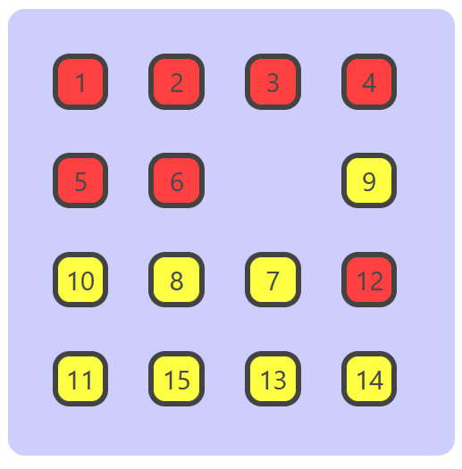
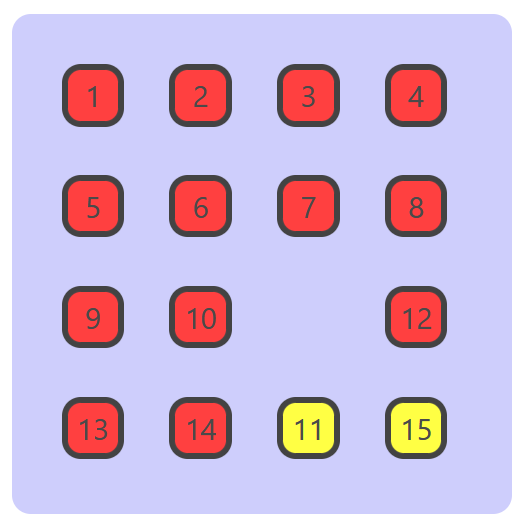

### Objective
Your goal is to position all elements in the 15-puzzle in ascending order.

### Steps to Follow

#### 1. Generate the Puzzle
- Click on "Generate" to populate the grid with a random solvable 15-puzzle instance.

#### 2. Moving Tiles
- Click on tiles adjacent to the empty space to move them.
- The clicked tile will move into the empty space.

#### 3. Solving the Puzzle
- Arrange all numbered tiles in ascending order (1-15).
- Start from the first row, moving left to right.
- Continue row by row until the grid is complete.
- The final position should have the empty space (16th position) after the number 15.

#### 4. Getting Help
- If you get stuck, click on "Hints" for guidance.
- Hints will provide helpful suggestions without giving away the complete solution.

### Solving Example

We attempt to solve an instance of the 15-puzzle here. Here a single step denoted by 2-cycles in the form $(a,b)$ indicates that the tile at position $b$ is moved to position $a$, thus creating empty space at $b$. Using multiplication with the 2-cycles at each step, we permute the initial permutation $(10,1,5,6,4,8,12,9,7,15,2,13,11,3,14,16)$ into the identity permutation for the set. We achieve this using the strategy provided in hints.

#### Step 1: Fixing $1,2$

$(16,15)\rightarrow(15,14)\rightarrow(14,13)\rightarrow(13,9)\rightarrow(9,5)\rightarrow(5,1)\rightarrow(1,2)\rightarrow(2,3)\rightarrow(3,7)\rightarrow(7,11)\rightarrow(11,10)\rightarrow(10,6)\rightarrow(6,7)\rightarrow(7,3)\rightarrow(3,2)\rightarrow(2,6)$

#### Step 2: Fixing $3,4$

$(6,10)\rightarrow(10,9)\rightarrow(9,13)\rightarrow(13,14)\rightarrow(14,15)\rightarrow(15,11)\rightarrow(11,10)\rightarrow(10,6)\rightarrow(6,7)\rightarrow(7,11)\rightarrow(11,12)\rightarrow(12,8)\rightarrow(8,4)\rightarrow(4,3)\rightarrow(3,7)\rightarrow(7,6)\rightarrow(6,10)\rightarrow(10,14)\rightarrow(14,15)\rightarrow(15,11)\rightarrow(11,10)\rightarrow(10,6)\rightarrow(6,7)\rightarrow(7,11)\rightarrow(11,12)\rightarrow(12,8)\rightarrow(8,4)\rightarrow(4,3)\rightarrow(3,7)$

#### Step 3: Fixing $5,6$

$(7,8)\rightarrow(8,12)\rightarrow(12,11)\rightarrow(11,10)\rightarrow(10,6)\rightarrow(6,7)\rightarrow(7,11)\rightarrow(11,10)\rightarrow(10,9)\rightarrow(9,5)\rightarrow(5,6)\rightarrow(6,7)\rightarrow(7,8)\rightarrow(8,12)\rightarrow(12,11)\rightarrow(11,10)\rightarrow(10,6)\rightarrow(6,7)$

#### Step 4: Fixing $7,8$

$(7,11)\rightarrow(11,10)\rightarrow(10,14)\rightarrow(14,15)\rightarrow(15,11)\rightarrow(11,7)\rightarrow(7,8)\rightarrow(8,12)\rightarrow(12,16)\rightarrow(16,15)\rightarrow(15,11)\rightarrow(11,12)\rightarrow(12,16)\rightarrow(16,15)\rightarrow(15,11)\rightarrow(11,12)\rightarrow(12,8)\rightarrow(8,7)\rightarrow(7,11)\rightarrow(11,15)\rightarrow(15,16)\rightarrow(16,12)\rightarrow(12,11)\rightarrow(11,15)\rightarrow(15,16)\rightarrow(16,12)\rightarrow(12,8)\rightarrow(8,7)\rightarrow(7,11)$

#### Step 5: Fixing $9,13$

$(11,10)\rightarrow(10,9)\rightarrow(9,13)\rightarrow(13,14)\rightarrow(14,10)\rightarrow(10,9)\rightarrow(9,13)\rightarrow(13,14)\rightarrow(14,10)\rightarrow(10,11)\rightarrow(11,12)\rightarrow(12,16)\rightarrow(16,15)\rightarrow(15,14)\rightarrow(14,10)\rightarrow(10,11)\rightarrow(11,15)\rightarrow(15,14)\rightarrow(14,13)\rightarrow(13,9)\rightarrow(9,10)$

#### Step 6: Fixing $10,14$

$(10,11)\rightarrow(11,12)\rightarrow(12,16)\rightarrow(16,15)\rightarrow(15,14)\rightarrow(14,10)\rightarrow(10,11)\rightarrow(11,15)\rightarrow(15,14)\rightarrow(14,10)\rightarrow(10,11)$

#### Step 7: Fixing $11,12,15$

$(11,15)\rightarrow(15,16)$

Thus we have completed the 15-puzzle.