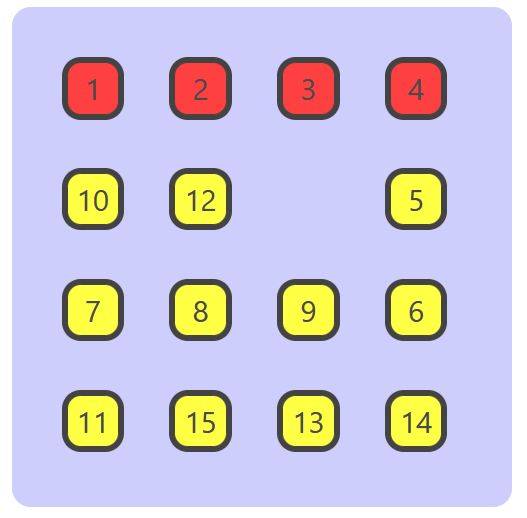
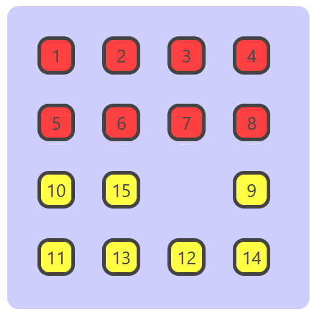
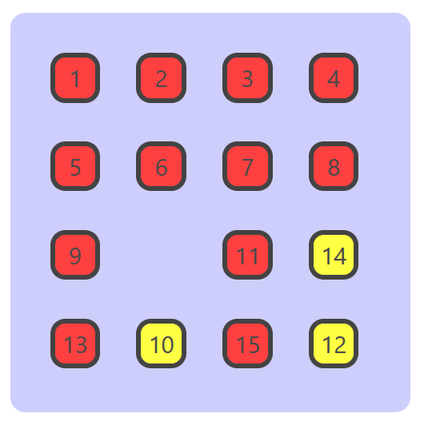

# Procedure
The experiment provides you with a 15-puzzle where your goal is to position its elements in ascending order.

During the experiment:-
Click on Generate to populate the grid with a random solvable 15-puzzle instace.
Click on Hints to generate a hint on what to do next if you are stuck. The hints will be helpful but won't outright provide you with a step by step solution.
You can move the tile by clicking on tiles adjacent to the empty space, that will move the tile that is clicked on to the empty space.
The ascending order of the tiles will be, starting fromt the first row, from left to right until a row is complete, then moving on to the next row and so on until the grid is complete.
All numbered tiles must be arranged in ascending oreder starting from 1 and ending with empty space on the 16th position preceded by 15 in the space immidiately to the left of it.

## Example

We attempt to solve an instance of the 15-puzzle here. Here a single step denoted by 2-cycles in the form $(a,b)$ indicates that the tile at position $b$ is moved to position $a$, thus creating empty space at $b$. Usinng multiplication with the 2-cycles at each step, we permute the initial permutation $(10,1,5,6,4,8,12,9,7,15,2,13,11,3,14,16)$ into the identity permutation for the set. We achieve using the stretegy provided in hints.

Fixing $1,2$

$(16,15)\rightarrow(15,14)\rightarrow(14,13)\rightarrow(13,9)\rightarrow(9,5)\rightarrow(5,1)\rightarrow(1,2)\rightarrow(2,3)\rightarrow(3,7)\rightarrow(7,11)\rightarrow(11,10)\rightarrow(10,6)\rightarrow(6,7)\rightarrow(7,3)\rightarrow(3,2)\rightarrow(2,6)$

Fixing $3,4$

$(6,10)\rightarrow(10,9)\rightarrow(9,13)\rightarrow(13,14)\rightarrow(14,15)\rightarrow(15,11)\rightarrow(11,10)\rightarrow(10,6)\rightarrow(6,7)\rightarrow(7,11)\rightarrow(11,12)\rightarrow(12,8)\rightarrow(8,4)\rightarrow(4,3)\rightarrow(3,7)\rightarrow(7,6)\rightarrow(6,10)\rightarrow(10,14)\rightarrow(14,15)\rightarrow(15,11)\rightarrow(11,10)\rightarrow(10,6)\rightarrow(6,7)\rightarrow(7,11)\rightarrow(11,12)\rightarrow(12,8)\rightarrow(8,4)\rightarrow(4,3)\rightarrow(3,7)$

Fixing $5,6$

$(7,8)\rightarrow(8,12)\rightarrow(12,11)\rightarrow(11,10)\rightarrow(10,6)\rightarrow(6,7)\rightarrow(7,11)\rightarrow(11,10)\rightarrow(10,9)\rightarrow(9,5)\rightarrow(5,6)\rightarrow(6,7)\rightarrow(7,8)\rightarrow(8,12)\rightarrow(12,11)\rightarrow(11,10)\rightarrow(10,6)\rightarrow(6,7)$

Fixing $7,8$

$(7,11)\rightarrow(11,10)\rightarrow(10,14)\rightarrow(14,15)\rightarrow(15,11)\rightarrow(11,7)\rightarrow(7,8)\rightarrow(8,12)\rightarrow(12,16)\rightarrow(16,15)\rightarrow(15,11)\rightarrow(11,12)\rightarrow(12,16)\rightarrow(16,15)\rightarrow(15,11)\rightarrow(11,12)\rightarrow(12,8)\rightarrow(8,7)\rightarrow(7,11)\rightarrow(11,15)\rightarrow(15,16)\rightarrow(16,12)\rightarrow(12,11)\rightarrow(11,15)\rightarrow(15,16)\rightarrow(16,12)\rightarrow(12,8)\rightarrow(8,7)\rightarrow(7,11)$

Fixing $9,13$

$(11,10)\rightarrow(10,9)\rightarrow(9,13)\rightarrow(13,14)\rightarrow(14,10)\rightarrow(10,9)\rightarrow(9,13)\rightarrow(13,14)\rightarrow(14,10)\rightarrow(10,11)\rightarrow(11,12)\rightarrow(12,16)\rightarrow(16,15)\rightarrow(15,14)\rightarrow(14,10)\rightarrow(10,11)\rightarrow(11,15)\rightarrow(15,14)\rightarrow(14,13)\rightarrow(13,9)\rightarrow(9,10)$

Fixing $10,14$

$(10,11)\rightarrow(11,12)\rightarrow(12,16)\rightarrow(16,15)\rightarrow(15,14)\rightarrow(14,10)\rightarrow(10,11)\rightarrow(11,15)\rightarrow(15,14)\rightarrow(14,10)\rightarrow(10,11)$

Fixing $11,12,15$

$(11,15)\rightarrow(15,16)$

Thus we have completed the 15-puzzle.